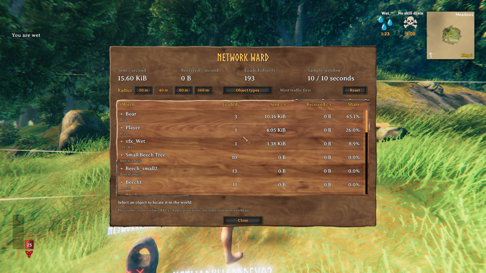
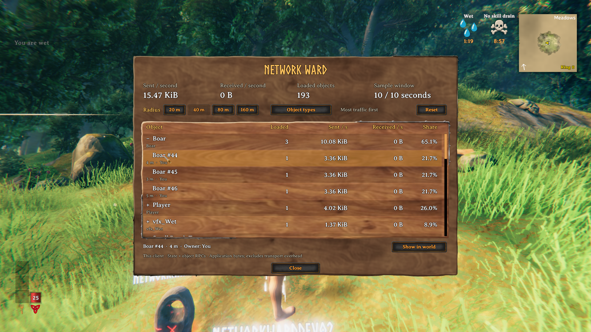
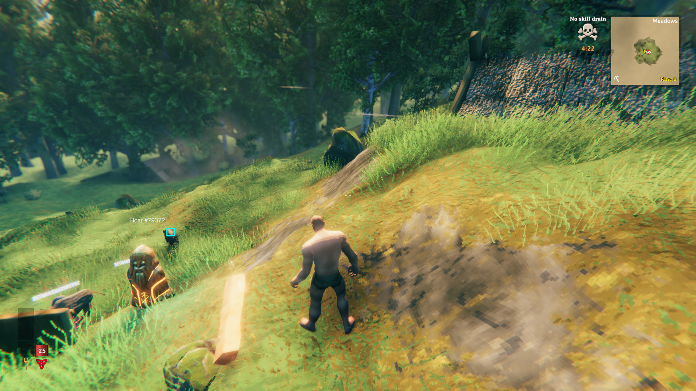

# Network Ward validation — 2026-09-18

Validated on Valdev with both Valnet clients connected through Steam.
All three used the isolated `network-ward-s8-8.0.21` profile, based on the current
Praetoris Season 8 8.0.21 manifest. Manifest dependency versions were checked,
including Network Performance System 1.5.0. Client test helpers were valheimCLI
and Server Devcommands. The candidate replaced PraetorisClient in the test profiles.

The original measurement-test DLL SHA-256 matched on all three devices:
`b7a05529afc89df106da1934ad3fe78f8acdfe009c4247e82dba3438f09a00ec`.
Valdev ran game 1.0.12; Steam updated both clients to 1.0.15. All used network
version 40. This verifies that mixed-build test environment, not identical game builds.

## Results

- Release build passed: zero errors, 85 existing warnings.
- Packet-reader fixtures passed: exact state/RPC byte sizes, exclusions, malformed
  packets and restoration of the original packet cursor.
- Both clients passed server mod validation and loaded the new ward.
- Normal ward interaction opened the window. Group expansion showed individual
  objects, owner names, distance and rates. Quiet trees remained visible with zero traffic.
- Changing the radius from 40 m to 20 m reduced the loaded-object list.
- Closing with Escape stopped sampling. Death also closed the window.
- Selecting an instance and choosing **Show in world** closed the window and showed
  the cyan marker and object label. The final marker screenshot verifies this behavior.
- Ten damage RPCs from client 02 to a boar owned by client 01 produced exactly
  1,260 sent bytes on client 02 and 1,260 received bytes on client 01.
- Both clients also attributed state traffic to that boar. Every one of the 30
  inspected rows on each client satisfied `sent + received == state + rpc`.
- Both final samples reported `parseErrors=0`.

Final ten-second samples for the same boar:

| Client | Sent bytes | Received bytes | State bytes | RPC bytes | Owner |
| --- | ---: | ---: | ---: | ---: | --- |
| 01 | 46,990 | 1,260 | 45,653 | 2,597 | You |
| 02 | 1,260 | 45,095 | 43,713 | 2,642 | NetworkWardDev01 |

Snapshots were taken at different times, so their state totals need not match.
The screenshots below show the later native-UI revision, except for the world marker.

## Native Valheim UI revision

Replaced the custom IMGUI panel with Valheim wood panels, Norse/Averia fonts,
native buttons with game sounds, and a native scrollbar. Removed the subtitle.
The table reuses nine row controls as the list scrolls. Measurement code is unchanged.

Release build passed with zero errors and the same 85 existing warnings. The revised
DLL (`73b853405f3a7d0e3a3af508048766d4ab477b956aeedc3f114b74fd4d7263f8`)
was tested on Valdev and Valnet client 01 with the same isolated 8.0.21 profiles.
Verified group expansion, instance selection, Show in world, individual view,
mouse-wheel scrolling, dragging the scrollbar to later objects, radius changes,
reset, the Close button, Escape, and reopening. Radius 40 m listed 193 objects;
20 m listed 72. Both close paths stopped sampling. No Network Ward exception
stacks or packet parsing warnings appeared in the client log.

The UI revision was checked on one client; the two-client traffic proof above
remains from the previous build. Test objects were removed, original profiles
restored, and Valdev and client 01 stopped after capture.

## Screenshots

Client 01: native Valheim panels, object types, and quiet objects.

Client 01: expanded boar instances and ownership.

Client 01: selected object marked in the world.

## Limits and log review

No Network Ward exceptions or parsing warnings appeared in the final logs.
The run was not globally error-free: client logs contain shader-platform errors,
ValheimEnforcer `ModManager.SetModsActive` menu exceptions, and retries for old
PraetorisClient telemetry uploads. FastLink reported no configured servers because
the isolated test profiles used direct connection. Server errors concern headless
rendering/video shaders and the intro cinematic. These unrelated issues were not
fixed by this feature.

Live coverage is Steam with NPS 1.5.0. PlayFab and TCP hooks compiled but were not
validated in live sessions. This is a functional test, not a large-base overhead
benchmark or proof that high traffic causes a particular player's lag. The ward
reports client application traffic under the [measurement contract](network-ward.md).

Test characters logged out with saves. Cleanup commands removed the test wards
and six spawned boars. Original device profiles were restored. Valdev was returned
to its original stopped state; both Valnet machines were stopped after capture.
