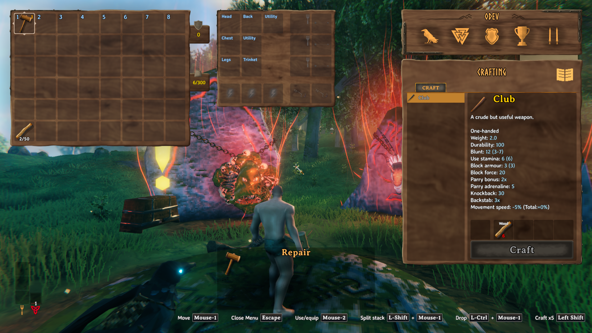
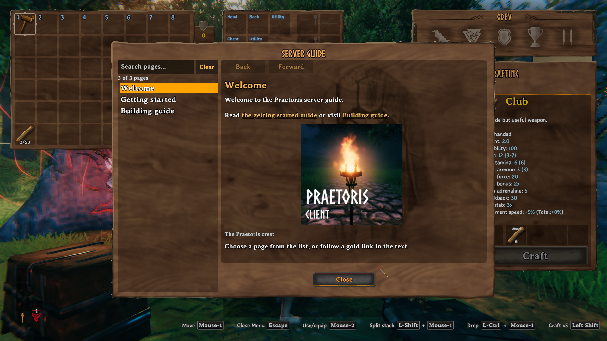
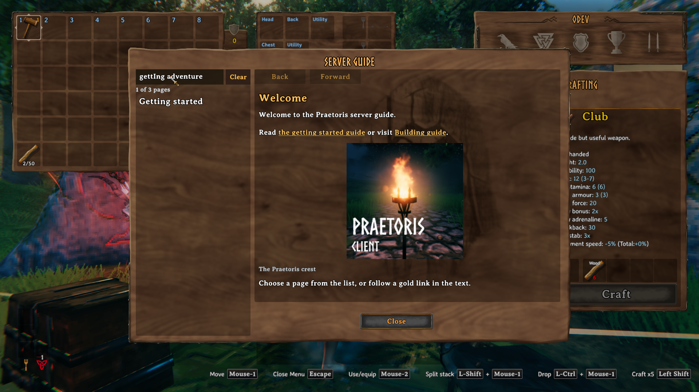
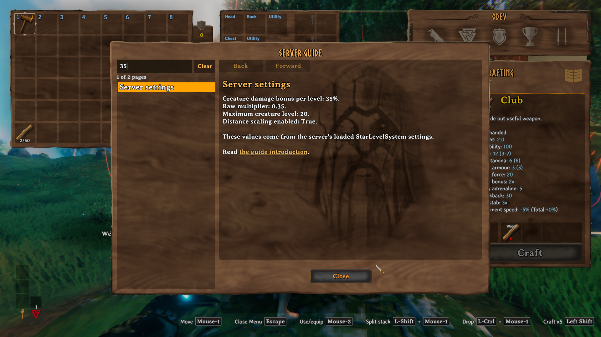

# Server guide

Install this PraetorisClient build on the server and clients. Players open their
inventory and select the large gold **book icon to the right of the Crafting heading** to open
**Server Guide**. This separate window contains only the server's guide pages.
The Valheim compendium is unchanged.
Players can also run `praetoris_guide` in the game console. Select **Close** or press
Escape to close the guide.



Guide pages have **Back** and **Forward** buttons. They follow browsing history and
restore each page's scroll position. Mouse side buttons also move through history.
Gold, underlined links open other guide pages. Images appear within the page with
optional captions.

Use **Search pages** above the page list to filter by title, body text, link labels,
or image captions. Search ignores letter case and matches all words you enter.
The count shows how many pages match. **Clear** restores the full list. Filtering
keeps the current page open. If a link or history button opens a page outside the
results, the search clears so the destination appears in the list.





## Write pages

The server creates `BepInEx/config/PraetorisClient.ServerGuide.txt` on first start.
Edit the file in the active server profile. No client file is needed.

```text
# Welcome
Welcome to Praetoris.

Read [[Rules|the server rules]] before you start building.


# Rules
Respect other players and their buildings.

Return to [[Welcome]].

# Getting started
Write your server's starting instructions here.
```

- Start each page with `# ` followed by its title.
- Pages appear in file order. Titles must be unique.
- Use blank lines between paragraphs. This is a text format, not a Markdown renderer.
- The game supports its normal rich-text tags in page bodies, such as `<b>bold</b>`.
- Titles can contain up to 80 characters. They cannot contain `<`, `>`, `$`, `[`, `]` or `|`.
- Each body can contain up to 16,000 characters.
- A guide can contain up to 64 pages and 128 KiB of UTF-8 text.
- Save an empty file to remove all guide pages. Deleting the file creates the sample again.

## Links

Use `[[Page title]]` to show a page title as a link. Use `[[Page title|Link label]]`
to give the link a different label. Targets are matched without regard to letter
case. Every target must exist in the same guide. Link labels are plain text.

## Display mod settings

Insert a server mod's current BepInEx config value with `{{ModName.SettingName}}`:

```text
# Creature scaling
Damage bonus per creature level: {{StarLevelSystem.EnemyDamageLevelMultiplier|percent}}.
Maximum creature level: {{StarLevelSystem.MaxLevel}}.
Distance scaling enabled: {{StarLevelSystem.EnableDistanceLevelScalingBonus}}.
```

If `EnemyDamageLevelMultiplier` is `0.25`, the example displays `25%`.
Without `|percent`, it displays `0.25`. Percent formatting accepts numbers and
uses up to two decimal places. It multiplies the value by 100; use it for a
fraction such as `0.25`, not a setting that already stores `25`.

- Use the mod's BepInEx display name or plugin GUID. Names ignore letter case.
- Use the setting's exact key from its `.cfg` file. A C# field name may differ.
- If a key occurs in multiple sections, include the section:
  `{{StarLevelSystem.LevelSystem.EnemyDamageLevelMultiplier|percent}}`.
- A fully qualified reference also works:
  `{{MidnightsFX.StarLevelSystem.LevelSystem.EnemyDamageLevelMultiplier|percent}}`.
- References work in body text, link labels, and image captions. Keep page titles,
  link destinations, and image filenames fixed.
- Referenced values are plain text and can contain at most 512 characters.
- The mod must be loaded on the server and expose the setting through its normal
  BepInEx config. Separate YAML tables and custom data files are not config keys.

The server reads the loaded values every five seconds. Changes appear through
normal guide synchronization, even if the guide text file did not change.
The referenced mod must first load the changed setting; a setting that needs a
restart will not change until that mod loads it. All players receive the same
server values, and guide search includes the displayed values.

A missing mod, unknown key, ambiguous key, invalid format, or oversized result
rejects the update. The server logs the reference and keeps the last valid guide.
Only settings explicitly referenced by the server's guide author are sent.

StarLevelSystem's `EnemyDamageLevelMultiplier` controls damage per creature level.
It is not a direct damage-per-ring value. Its distance-ring tables live in
`LevelSettings.yaml` and are outside this config-key reader.



## Images

Put PNG files in `BepInEx/config/PraetorisClient.ServerGuide.images/` on the server.
The server creates this folder automatically. Reference an image on its own line:

```text

```

The text in brackets is the caption. Use `` for no caption.

- Use a filename, without folders or URLs. Match its letter case exactly.
- Filenames can contain letters, numbers, underscores, hyphens and dots. They must end in `.png`, start with a letter, number, underscore or hyphen, and cannot contain `..`.
- Each filename can contain at most 100 characters.
- Each PNG can be at most 512 KiB, 2048 pixels per side, and 2,097,152 pixels total.
- A guide can reference at most eight different images. A page can contain at most 16 image blocks.
- Referencing the same image on several pages downloads it only once per guide revision.

Players receive referenced images from the server in bounded chunks. The client
checks the completed image against its expected hash before using it. Images are
held in memory for the current connection. Players do not need to install image files.

## Live edits

The server checks for text and image edits every five seconds. Connected players
check for a new version every ten seconds. An open guide refreshes automatically
and keeps the current page if it still exists. History keeps pages that still exist.
Image transfer time depends on file sizes and the connection. A placeholder appears
while an image is loading.

Players receive the guide automatically when they join. Pages are not written to
the player's saved compendium. Logout clears the pages and releases the images.

If an edit has an invalid page link, missing image, or invalid PNG file, the server
logs the reason and keeps the last valid guide and images.
Correct and save the file to try again. Only the connected server can supply
pages; clients cannot edit or upload the guide.

## Check operation

- `praetoris_guide_status`: show page count, received image count, and content revision. When the reader is open, also show the page, search match count, search focus, history availability, and scroll position.
- `praetoris_guide_reload`: force a text and image reload from the server console.
- Client log: `Received server guide: ...`.
- Server log: `Loaded server guide: ...`.
- Client image log: `Received guide image: ...` with byte count and hash.

Client and server revisions must match after synchronization.

Run parser checks with `dotnet run --project tests/ServerGuide/ServerGuide.Tests.csproj`.

See [live validation](server-guide-validation.md) for the tested environment and results.
