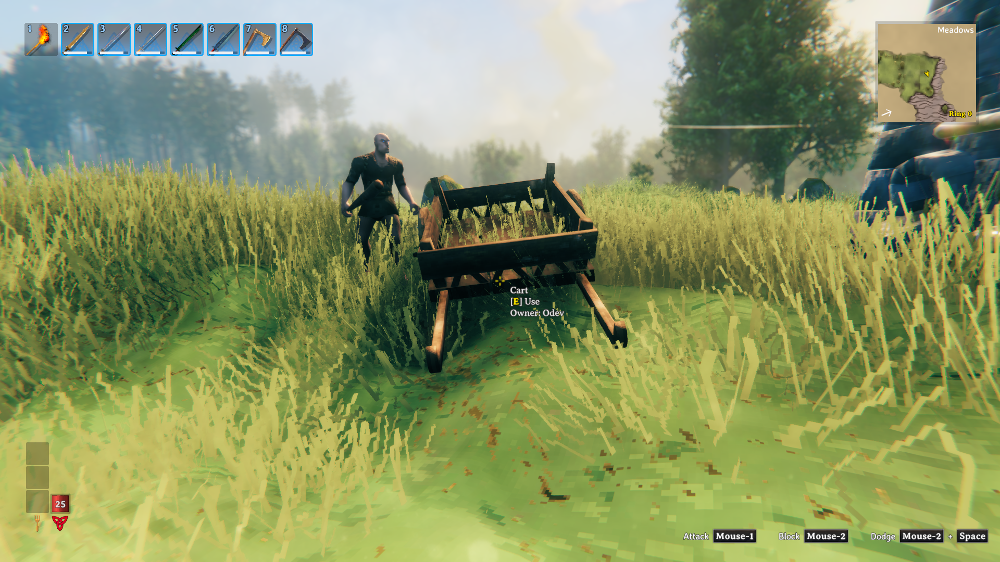
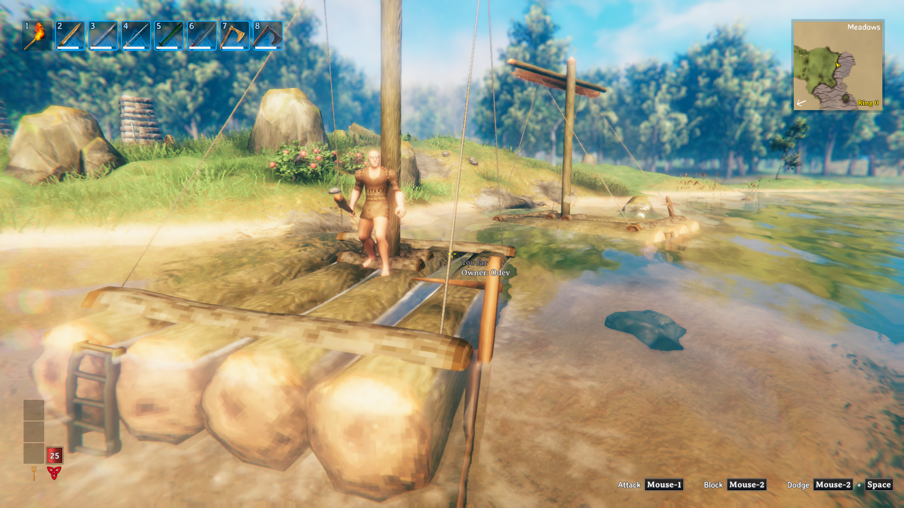

# Vehicle creator-name validation

Date: 2026-09-24. Candidate: PraetorisClient 0.1.82.

## Behavior

New ships and carts save the builder's character name in `praetoris_creatorName` on the vehicle ZDO. Hover text reads the saved name and applies the existing character-name filter. The stored value represents the name at construction time.

Existing vehicles without that field keep the original lookup: loaded player, then platform-name history, then the unknown-name label. The owner label itself is unchanged.

## Environment

- Valdev dedicated server, world `mwlPortIconTest`, Valheim l-1.0.15.
- Valnet client 02: builder `Odev`. Valnet client 01: observer `GCLoad01`.
- Server test profile: `vehicle-names-s8-8.0.26`.
- Client test profiles: `vehicle-furnace-s8-8.0.26`.
- Profiles were copied from the Season 8 8.0.26 test profiles used for the preceding terrain investigation. Production 8.0.27 was staged, not deployed. The deployed 0.1.79 DLL was the reproduction baseline.
- Candidate 0.1.82 installed on the server and both clients. Added command/probe tools and allowed the probe only in the test server's mod manifest. Used no-cost hammer placement, development characters, scripted travel, and camera controls.
- Messaging integrations were omitted on the server. Client screenshot integration had no webhook configured. This is a Season 8-based multiplayer test, not a byte-identical production installation or a test of every optional mod.

Candidate DLL SHA-256 on all three hosts and in the release ZIP:

```text
1f99a80304e4a8ba4469f4cef5d31f4c9b1d7f80c7b92417a99489b01bb0d9b1
```

## Reproduction and results

Vehicles were created through the normal hammer placement path (`cli_build_try_place_at ... nocost`), not through a prefab spawn or a direct ZDO edit. The test probe reads the vehicle's ZDO and calls its real `GetHoverText` implementation; it does not supply a replacement name.

| Case | Result |
| --- | --- |
| Baseline 0.1.79: place cart and raft, then log out the builder | Observer sees `creatorLoaded=False`, an empty saved-name field, and `Owner: Server` instead of `Odev`. |
| Candidate: place a new cart and raft | Both save `Odev`; both display `Owner: Odev` to the builder and observer. |
| Builder travels outside the observer's loaded area | Both new vehicles still display `Odev`, with `creatorLoaded=False`. |
| Builder logs out | Both new vehicles still display `Odev` to the observer. |
| Observer logs out; Valdev saves, stops and starts; only observer reconnects | Both new vehicles retain `stored='Odev'` and display `Owner: Odev`, with `creatorLoaded=False`. Old vehicles retain empty fields and the original fallback. |
| Pre-update cart and raft under the candidate | Saved field remains empty. Their labels continue to follow the original fallback, including platform names or `Unknown` as history availability changes. |

Representative observer output with the builder logged out:

```text
OBSERVER character=GCLoad01
VEHICLE prefab=Raft(Clone) pos=(455.56, 29.28, -8.85) creatorLoaded=False stored='Odev' hover='Too far | Owner: Odev'
VEHICLE prefab=Cart(Clone) pos=(417.92, 32.05, -7.58) creatorLoaded=False stored='Odev' hover='Cart | [E] Use | Owner: Odev'
VEHICLE prefab=Cart(Clone) pos=(418.11, 31.49, 0.09) creatorLoaded=False stored='' hover='Cart | [E] Use | Owner: Unknown'
VEHICLE prefab=Raft(Clone) pos=(455.06, 29.47, 1.76) creatorLoaded=False stored='' hover='Too far | Owner: Unknown'
```

Unity rich-text tags were removed from this excerpt for readability. `Too far` is the stock rudder interaction-distance message; the owner line is appended independently of that message.

After the server restart, the observer read:

```text
OBSERVER character=GCLoad01
VEHICLE prefab=Cart(Clone) pos=(418.16, 31.49, 0.08) creatorLoaded=False stored='' hover='Cart | [E] Use | Owner: Server'
VEHICLE prefab=Cart(Clone) pos=(417.93, 32.06, -7.58) creatorLoaded=False stored='Odev' hover='Cart | [E] Use | Owner: Odev'
VEHICLE prefab=Raft(Clone) pos=(455.02, 29.61, 1.82) creatorLoaded=False stored='' hover='Too far | Owner: Server'
VEHICLE prefab=Raft(Clone) pos=(455.56, 29.66, -8.85) creatorLoaded=False stored='Odev' hover='Too far | Owner: Odev'
```

An initial reconnect attempt ran before the restarted server was ready and failed. The proof above is from the subsequent connected session after loading completed.

The screenshot below was captured and inspected on the observer client while the builder was logged out. The visible character is the observer.



The raft screenshot was captured after the server restart, with only the observer connected.



## Build and scope

- Release build succeeded: zero errors, 83 warnings in existing code; none in `CreatorHoverPatches.cs`.
- `tcli build` produced `praetoris-PraetorisClient-0.1.82.zip`. Verified its version, DLL hash, 256×256 icon, and file list against 0.1.81. No package was published.
- Tested vanilla raft and cart. Component-based selection also covers ships using `Ship` and carts using `Vagon`; other modded vehicle prefabs were not individually exercised.
- No migration of existing vehicles, name-change propagation, or ownership-transfer behavior was added.

## Log review

No vehicle-name patch exception was found. Both clients logged existing shader-platform warnings at startup. The temporary probe threw when called before a local player existed; separate furnace diagnostics also selected a build ghost and threw. Those failed diagnostic calls are excluded from the proof. Client 02's screenshot integration reported an empty webhook while handling an older stored death screenshot. These test-environment errors are separate from the successful vehicle placement, replication and persistence checks; this is not a claim that the full modpack is error-free.

Raw session evidence is retained locally under `/Users/benjmarston/Develop/valheim-validation-evidence/vehicle-furnace-20260924`.

## Cleanup

Restored Valdev to `season8-1-0-migration` and its original stopped state. Restored client 01 to `praetoris-season-8-8.0.15` and client 02 to `praetoris-season-8-8.0.15-ship-hover-0.1.66`. Both Paperspace clients were stopped and verified off. Test profiles and evidence were retained. Production was not changed.
