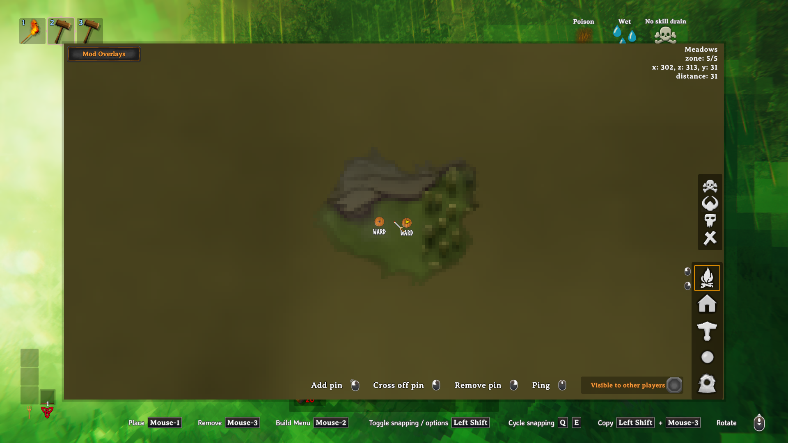

# Automatic ward map pins

The small and large maps show a banded shield icon at each ordinary ward built by the current character. Disabled wards are included. Wards built by other players, Creature Owner Wards, and Network Wards are excluded.

Install the updated PraetorisClient on both the server and client. The server supplies ward positions across the whole world. The client does not need to visit a ward in the current session to see its pin.

The client requests an update every five seconds. The server shares a five-second world snapshot between requests from different players. A change can therefore take up to about ten seconds to appear, plus network delay. If updates stop for thirty seconds, the client removes the stale pins.

Pins are removed when their wards are destroyed. Reconnecting rebuilds the pin list. Switching character or world clears the old pins. Automatic ward pins are not saved as manual pins, cannot be deleted through the normal manual-pin action, and are excluded from cartography-table sharing. Existing manual pins are unchanged.

The icon comes from the `ShieldBanded` item. The feature does not change the ward prefab icon or the Forge of Potential icon.

## Live validation procedure

Use Valdev and one Valnet client with the current production mod set and a development character.

1. Confirm that a character with no wards has no automatic ward pins.
2. Build two ordinary wards through the Hammer placement path. Confirm that both maps show shield pins, including while the wards are disabled.
3. Add a ward with another creator. Confirm that its position does not receive a pin.
4. Move far enough away to unload the owned wards. Confirm that their pins remain.
5. Log out and reconnect. Confirm that the pins return without duplicates.
6. Destroy an owned ward. Confirm that only its pin disappears after a refresh.
7. Remove the remaining test wards. Confirm that the automatic pin list is empty.
8. Check client and server logs. Restore the original profile files and remove test helpers.

## Validation result — 2026-10-09

Tested on `valnet-client-01` connected to Valdev with the deployed Season 8 8.0.39 plugin binaries and the candidate PraetorisClient build. All matching plugin DLL hashes were identical to production except PraetorisClient. Client test helpers were valheimCLI, Server Devcommands, and a temporary ward inspection plugin.

- A new development character started with zero pins.
- Hammer placement created two disabled wards and two shield pins. A third ward with another creator had no pin.
- Both pins remained at a distant position with zero loaded owned wards. Reconnecting there restored exactly two pins.
- Destroying one owned ward reduced the pin count to one. Removing the remaining fixtures reduced it to zero.
- Screenshots verified the large map and small minimap. Inspection confirmed `save=False` and the `shield_banded0` sprite.
- The Release build passed with no errors. The build reported 84 warnings in existing code.

The test logs contained no ward-pin exceptions. Other logs included Linux shader warnings, PieceManager icon-snapshot exceptions during session transitions, and an empty Discord Screenshots webhook error after the development character died. The server's shader and More Vanilla Build Prefabs `Trailership` warnings also occur on production. These unrelated messages mean the complete mod set does not have a clean log.
